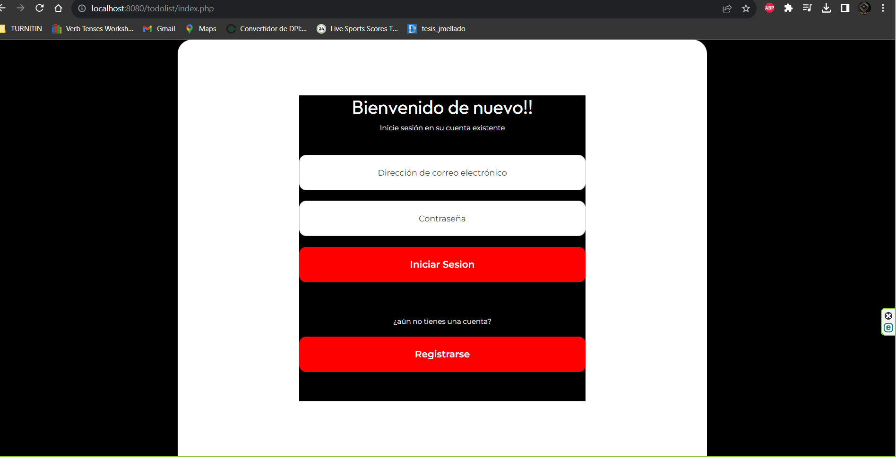
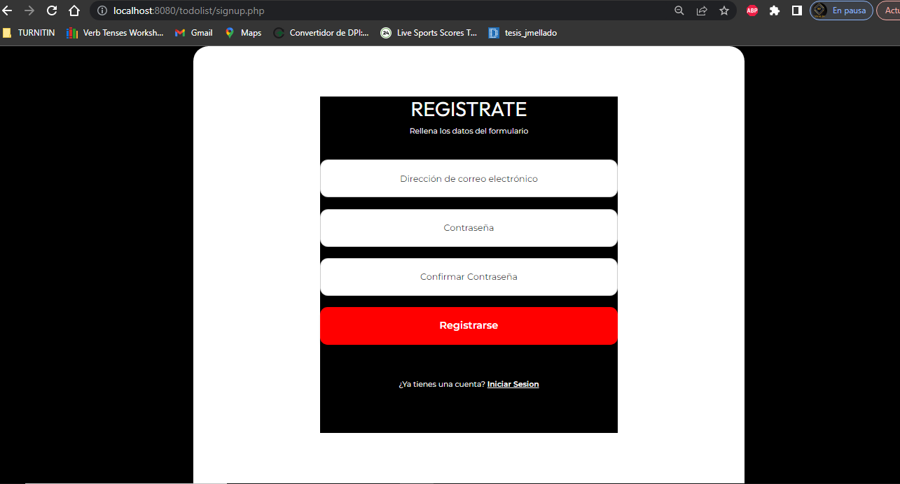
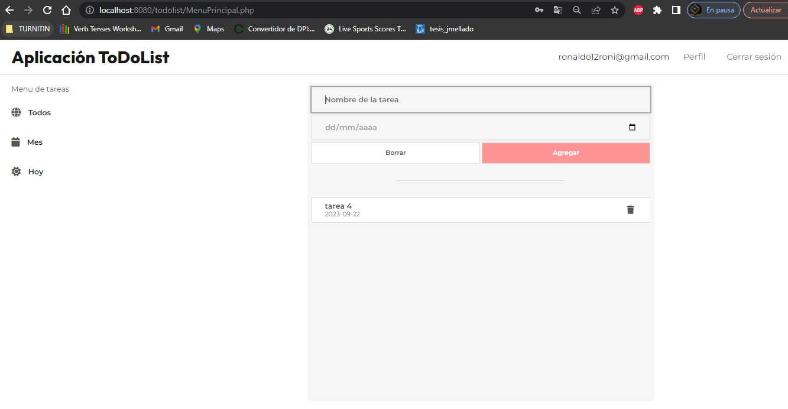
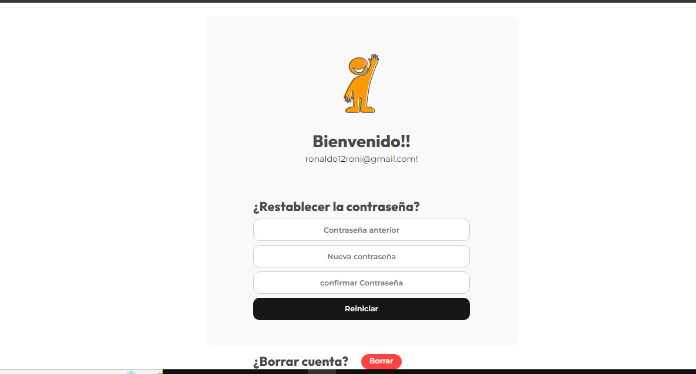

# Documentacion del proyecto TodoList
 Este proyecto se desarrollara con lenguaje de programacion php y como gestor de Base de Datos el MySQL y un poco de JavaScript,BOSTRAP.
## 1. Conexion a la base de datos 

Primero, se establece una conexión a la base de datos MySQL utilizando PHP y la extensión MySQLi. A continuación, se detalla el código relevante:
### Conexión a la Base de Datos

El siguiente código PHP se utiliza para establecer una conexión a la base de datos MySQL:

```php
<?php

// Parámetros de conexión a la base de datos
$dbhost = "localhost";
$dbusername = "root";
$dbpassword = "";
$database = "task";

// Crear una nueva conexión utilizando MySQLi
$mysqli = new mysqli($dbhost, $dbusername, $dbpassword, $database);

// Verificar si la conexión se estableció correctamente
if ($mysqli->connect_error) {
    // En caso de error de conexión, se cierra la conexión y se muestra un mensaje de error
    $mysqli->close();
    die("Connection failed: " . $mysqli->connect_error);
    exit(); // Se sale del script
}
```
## 2. Se crea el archivo index.php para implentar el login de ingreso
 
## 3 Se crea el archivo LoginAcc.php para la Autenticación de Usuario y Verificación de Contraseña
```php
<?php

// Obtener el correo electrónico y la contraseña del formulario POST
$email = $_POST['email'];
$password = $_POST['password'];

// Requerir el archivo de conexión a la base de datos
require_once 'Conexion.php';

// Comprobar si el correo electrónico existe en la base de datos
$sql = "SELECT * FROM users WHERE email = '$email'";
$result = $mysqli->query($sql);

if ($result->num_rows == 0) {
    // El correo electrónico no fue encontrado en la base de datos
    $error_message = 'El correo electrónico no existe';
    $mysqli->close();
    header('Location: index.php?error=' . urlencode($error_message));
    exit();
}

// Obtener la contraseña hash almacenada en la base de datos
$row = $result->fetch_assoc();
$hashedPassword = $row['password'];

if (password_verify($password, $hashedPassword)) {
    // Contraseña correcta: Iniciar sesión
    session_start();
    $_SESSION['email'] = $email;
    $mysqli->close();
    header('Location: MenuPrincipal.php');
    exit();
} else {
    // Contraseña incorrecta: Redirigir al formulario de inicio de sesión con un mensaje de error
    $error_message = 'Contraseña incorrecta';
    $mysqli->close();
    header('Location: login.php?error=' . urlencode($error_message));
    exit();
}
```
## 4 Se crea el archivo signupAcc.php para la Autenticación de registro de usuario.
 
### Estructura del Código
### El código consta de las siguientes partes:

### 1. Recopilación de Datos del Formulario
```php
$email = $_POST['email'];
$password = $_POST['password'];
$confirmPassword = $_POST['confirmPassword'];

```
Estas líneas de código recopilan los datos enviados desde el formulario HTML mediante el método POST.
### 2. Validación de Contraseña
```php
if ($password != $confirmPassword) {
    $error_message = "Las contraseñas no coinciden";
    header("Location: signup.php?error=" . urlencode($error_message));
    exit();
}
```
Esta sección verifica si la contraseña y su confirmación coinciden. Si no coinciden, se redirige al usuario de nuevo a la página de registro con un mensaje de error.
### 3. Verificación de Duplicados
```php
$sql = "SELECT * FROM users WHERE email = '$email'";
$result = $mysqli->query($sql);

if ($result->num_rows > 0) {
    $error_message = "Ya existe una cuenta con este correo electrónico";
    $mysqli->close();
    header("Location: signup.php?error=" . urlencode($error_message));
    exit();
}
```
Esta parte del código consulta la base de datos para verificar si ya existe un usuario con la misma dirección de correo electrónico. Si existe, se redirige al usuario de nuevo a la página de registro con un mensaje de error.
### 4. Registro del Nuevo Usuario
```PHP
$hashedPassword = password_hash($password, PASSWORD_DEFAULT);

$sql = "INSERT INTO users (email, password) VALUES ('$email', '$hashedPassword')";
$result = $mysqli->query($sql);

if (!$result) {
    $error_message = "Error al insertar los datos";
    $mysqli->close();
    header("Location: signup.php?error=" . urlencode($error_message));
    exit();
}
```
En esta sección, se crea un hash de la contraseña del usuario y se insertan los datos del nuevo usuario en la base de datos. Si ocurre un error durante la inserción, se muestra un mensaje de error y se redirige al usuario de nuevo a la página de registro.
### 5. Redirección al Inicio de Sesión
```php
$mysqli->close();
header("Location: index.php?success=1");
exit();
```
Finalmente, si el registro es exitoso, se cierra la conexión con la base de datos y se redirige al usuario a la página de inicio de sesión con un mensaje de éxito.
## MENU PRINCIPAL DE TODOLIST 
 
## perfil de usuario DE TODOLIST 
 